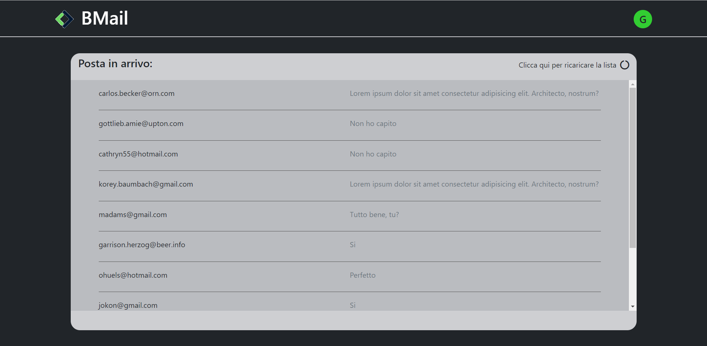

# VUE EMAIL LIST

> API - Far dialogare la pagina con l'esterno

### Screenshot

## FUNZIONALITA':

- Dato un API di email randomiche, tramite la libreria axios, generare 10 indirizzi email e stamparli all'interno di una lista.
  Per generare lista email cliccare sull'icona in alto a destra della sezione centrale.

## BONUS:

- Far comparire gli indirizzi email solamente quando sono stati tutti generati.
